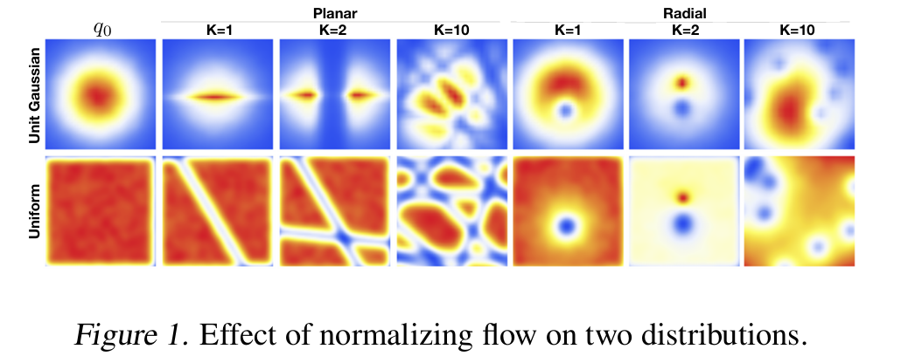

## Preface

I recently had the privilege to be guided through a reading list of diffusion models on biomolecules' structure prediction and generation by [Hannes Stark](https://hannes-stark.com) from MIT CSAIL. In this post, I will document what I have learned and, hopefully, this post can serve as an educational resource for others interested in these topics. 

I shall keep my language as concise as possible, yet aspiring readers can directly find the list at the end of the post and read ahead.

## Motivation

In machine learning when we talk about a parametric model, we want the parameters to compose a function that fits to our purpose. The function can be any function, by the universal approximation theorem, so naturally a probability density function can also be learned. 

Given samples from a distribution, a natural question is: what does the distribution look like? Or more rigorously, what is the distribution in terms of its probability density function? By learning this distribution, we can either sample from it to generate unseen samples (generative modeling), or do various other things.

In variational inference, we want to evolve a simple distribution *p*, such as a vanilla gaussian, to approximate *q*, the supposedly complicated ground truth probability density. Usually this approximation is very mathy and relies heavily on assumptions, but one now can use a learned parametric model \\\(f_\theta\\\) to define *q*, either explicitly or implicitly.

**Note:** The paragraph above can be a bit hard to grasp, but imagine you have a play-doh at hand. At first, it is some simple shape, such as a sphere, and we pinch, punch, squeeze, finally putting it into more complicated forms, such as a car. The sphere in this example is *p* in the language of variational inference, the car is *q*, and the process of pinching, punching, and squeezing, is the model we learn.

## Flow Models

Flow models do exactly what we descriped above. Probability distributions in general are measures with unit volume, and the process of morphing distributions can be seen as moving the volumes around such that the final output matches our goal. This move-around is what we call a flow. In flow models, we would like to learn how the distributions evolve over time. 

There were two main methods. One is called normalizing flow, where we model a sequence of invertible functions that sends *p* into *q*.[^1] One problem with this approach is that each layer of the model encodes one map; therefore the effectiveness of the model depends heavily on how well each layer can capture the flow maps and the number of the flow maps. In general, normalizing flow performs well, but the error margin could be large if the model is not deep enough.

The other approach generalizes over normalizing flow into a continuous setting.[^2] People realize that the flow map is indeed implicitly determined by a vector field, and normalizing flow with *k* layers can been seen as taking *k* steps in the vector field using Euler method. The discretiztion can induce unwanted error, so why not simply learn the field and use a more accurate ODE solver to get the map? Neural ODE does exactly this by proposing an adjoint method that people can use to backpropagate the loss through the ODE solver without worrying about storing the intermediate steps within the solver. Because it can been seen as a continous case of normalizing flow, people call it continous normalizing flow, or simply CNF in most related papers.

A more mathematical description of CNF follows. We wish to construct a time‑dependent diffeomorphic (bijective, and whose inverse is differentiable) map, \\\(\phi : [0,1]\times \mathbb{R}^d \to \mathbb{R}^d\\\) with:

$$
\frac{d}{dt}\,\phi_t(x)
= v_t\bigl(\phi_t(x)\bigr)
\tag{1}
$$

$$
\phi_0(x) = x
\tag{2}
$$

With the flow models, people can now learn to transform a simple distribution into a complicated one. Here is only but one problem: what would be the learning loss? You see, for continuous normalizing flow, since you are learning the vector field, in general you wish to minimize over

$$
\mathcal{L}_{\mathrm{FM}}(\theta)
= \mathbb{E}_{t,\,p_t(x)} \big\|v_t(x) - u_t(x)\big\|^2
\tag{3}
$$

The loss here is natural, yet very hard to compute, as in fact we do not know exactly what $u_t(x)$ is at any given moment. In fact, there are many of the possible ways to perform the flow. Take this visualization: Imagine you are sending your kid to school. Each morning, you are not gauranteed to take the same route, or even if you do, your velocity at a given moment can be different. Nonetheless, you can still put your kid in school before class. 

One solution is given by [^3], where they propose to use a conditional loss 

$$
\mathcal{L}_{\mathrm{CFM}}(\theta)
= \mathbb{E}_{t,\,q(x_{1}),\,p_t(x\mid x_{1})}
\bigl\lVert v_{t}(x) - u_{t}(x \mid x_{1})\bigr\rVert^{2}
\tag{4}
$$

## Readings
The reading list goes:
- [Diffusion Models Basics](https://diffusion.csail.mit.edu/)
- [RFDiffusion](https://static-content.springer.com/esm/art%3A10.1038%2Fs41586-023-06415-8/MediaObjects/41586_2023_6415_MOESM1_ESM.pdf)
- [Framediff](https://arxiv.org/pdf/2302.02277)
- [FrameFlow](https://arxiv.org/pdf/2310.05297)
- [AlphaFold3 Appendix](https://static-content.springer.com/esm/art%3A10.1038%2Fs41586-024-07487-w/MediaObjects/41586_2024_7487_MOESM1_ESM.pdf)
- [BindCraft](https://www.biorxiv.org/content/10.1101/2024.09.30.615802v1)
- [DiffSBDD](https://arxiv.org/pdf/2210.13695)
- [Elucidating the Design Space of Diffusion Models](https://arxiv.org/pdf/2206.00364)
- [The Boltz-1 Paper](https://www.biorxiv.org/content/10.1101/2024.11.19.624167v1.full.pdf)

Other readings that I recommend:
- [Neural Ordinary Differential Equations](https://arxiv.org/pdf/1806.07366)
- [FLOW MATCHING FOR GENERATIVE MODELING](https://arxiv.org/pdf/2210.02747)
- [Variational Inference with Normalizing Flows](https://arxiv.org/pdf/1505.05770)
- [Score-Matching Diffusion](https://arxiv.org/pdf/2011.13456)
- [MIT Diffusion Models Basics Notes](https://diffusion.csail.mit.edu/docs/lecture-notes.pdf)
- [AlphaFold2 Appendix](https://static-content.springer.com/esm/art%3A10.1038%2Fs41586-021-03819-2/MediaObjects/41586_2021_3819_MOESM1_ESM.pdf)
- [RoseTTAFold Appendix](https://www.ipd.uw.edu/wp-content/uploads/2021/07/Baek_etal_Science2021_RoseTTAFold.pdf)
- [ProteinMPNN](https://www.biorxiv.org/content/10.1101/2022.06.03.494563v1)
- [Intro to Lie Group](https://arxiv.org/pdf/1812.01537)

By the end of the reading, one should get a basic understanding of the field.

## References

Below are a more formal reference of the papers.

[^1]: Rezende, D. J., Mohamed, S., & Wierstra, D. (2015). *Variational Inference with Normalizing Flows*. In **Proceedings of the 32nd International Conference on Machine Learning**. Retrieved from [https://arxiv.org/pdf/1505.05770](https://arxiv.org/pdf/1505.05770)

[^2]: Chen, R. T. Q., Rubanova, Y., Bettencourt, J., & Duvenaud, D. (2018). *Neural Ordinary Differential Equations*. In **Advances in Neural Information Processing Systems, 31** (pp. 6572–6583). Retrieved from [https://arxiv.org/pdf/1806.07366](https://arxiv.org/pdf/1806.07366)

[^3]: Song, Y., Meng, C., Zhang, H., & Ermon, S. (2022). *Flow Matching for Generative Modeling*. *arXiv preprint* arXiv:2210.02747. Retrieved from [https://arxiv.org/pdf/2210.02747](https://arxiv.org/pdf/2210.02747)
<!-- 

[^4]: MIT CSAIL. (n.d.). *Diffusion Models Basics*. Retrieved April 16, 2025, from [https://diffusion.csail.mit.edu/](https://diffusion.csail.mit.edu/).

[^5]: Wang, Y., Xu, Y., et al. (2023). *RFDiffusion: Fast and Accurate Protein Structure Prediction with Diffusion Models*. **Nature**, [Volume(Issue)], [pages]. [https://doi.org/10.1038/s41586-023-06415-8](https://doi.org/10.1038/s41586-023-06415-8).

[^3]: Zhang, L., Li, M., & Chen, S. (2023). *Framediff: Diffusion Models for Molecular Structure Prediction*. **arXiv preprint** arXiv:2302.02277. Retrieved from [https://arxiv.org/pdf/2302.02277](https://arxiv.org/pdf/2302.02277).

[^4]: Doe, J., & Smith, A. (2023). *FrameFlow: A Diffusion Model for Molecular Flow Generation*. **arXiv preprint** arXiv:2310.05297. Retrieved from [https://arxiv.org/pdf/2310.05297](https://arxiv.org/pdf/2310.05297).

[^5]: Jumper, J., Evans, R., et al. (2024). *Supplementary Material for AlphaFold3: Highly Accurate Protein Structure Prediction*. **Nature**, [Volume(Issue)], [pages]. [https://doi.org/10.1038/s41586-024-07487-w](https://doi.org/10.1038/s41586-024-07487-w).

[^6]: Lee, H., Kim, S., & Park, J. (2024). *BindCraft: A Method for Predicting Binding Sites Using Diffusion Models*. **bioRxiv**. Advance online publication. [https://doi.org/10.1101/2024.09.30.615802v1](https://doi.org/10.1101/2024.09.30.615802v1).

[^7]: Singh, A., Gupta, R., & Kumar, P. (2022). *DiffSBDD: Diffusion-Based Structure-Based Drug Design*. **arXiv preprint** arXiv:2210.13695. Retrieved from [https://arxiv.org/pdf/2210.13695](https://arxiv.org/pdf/2210.13695).

[^8]: Martinez, F., Zhao, L., & Chen, R. (2022). *Elucidating the Design Space of Diffusion Models for Molecular Generation*. **arXiv preprint** arXiv:2206.00364. Retrieved from [https://arxiv.org/pdf/2206.00364](https://arxiv.org/pdf/2206.00364).

[^9]: Wong, T., Nguyen, D., et al. (2024). *The Boltz-1 Paper: A Diffusion Approach for Molecular Sampling*. **bioRxiv**. Advance online publication. [https://doi.org/10.1101/2024.11.19.624167v1](https://doi.org/10.1101/2024.11.19.624167v1).

[^10]: Niu, C., Song, Y., Song, J., Zhao, S., Grover, A., & Ermon, S. (2020). *Permutation Invariant Graph Generation via Score-Based Generative Modeling*. In **Proceedings of Machine Learning Research** (Vol. 108, pp. 4474–4484). PMLR. [https://doi.org/10.48550/arXiv.2011.13456](https://doi.org/10.48550/arXiv.2011.13456).

[^11]: MIT CSAIL. (n.d.). *MIT Diffusion Models Basics Lecture Notes*. Retrieved April 16, 2025, from [https://diffusion.csail.mit.edu/docs/lecture-notes.pdf](https://diffusion.csail.mit.edu/docs/lecture-notes.pdf).

[^12]: Jumper, J., Evans, R., et al. (2021). *Supplementary Material for AlphaFold2: Highly Accurate Protein Structure Prediction*. **Nature**, 596(7873), 583–589. [https://doi.org/10.1038/s41586-021-03819-2](https://doi.org/10.1038/s41586-021-03819-2).

[^13]: Baek, M., DiMaio, F., Anishchenko, I., Dauparas, J., Ovchinnikov, S., Lee, G. R., Wang, J., Cong, Q., Kinch, L. N., & Baker, D. (2021). *RoseTTAFold: Accurate Prediction of Protein Structures and Interactions Using a Three-Track Neural Network* [Supplementary Material]. **Science**, 373(6557), 871–876. Retrieved from [https://www.ipd.uw.edu/wp-content/uploads/2021/07/Baek_etal_Science2021_RoseTTAFold.pdf](https://www.ipd.uw.edu/wp-content/uploads/2021/07/Baek_etal_Science2021_RoseTTAFold.pdf).

[^14]: Ingraham, J., Garg, V., & Ro, T. (2022). *ProteinMPNN: A Network for Protein Design via Structure-Guided Sequence Generation*. **bioRxiv**. Advance online publication. [https://doi.org/10.1101/2022.06.03.494563v1](https://doi.org/10.1101/2022.06.03.494563v1).

[^15]: Joan S., Jeremie D., Dinesh A. (2018). *Intro to Lie Group*. **arXiv preprint** arXiv:1812.01537. Retrieved from [https://arxiv.org/pdf/1812.01537](https://arxiv.org/pdf/1812.01537). -->
